# Nutri Express — API REST de Delivery de Comida Saudável

Esta é a API REST do back-end para o aplicativo de delivery de comida saudável **Nutri Express**, desenvolvida em Java com Spring Boot e PostgreSQL, seguindo rigorosamente a arquitetura em camadas e as especificações da atividade prática.

## 🚀 Como Executar o Projeto

### 1. Subir o PostgreSQL via Docker

Execute o comando abaixo no terminal para iniciar o banco de dados no container Docker:

```bash
docker run --name postgres-nutriexpress -e POSTGRES_PASSWORD=postgres -e POSTGRES_DB=nutriexpress -p 5432:5432 -d postgres
```

### 2. Configurar o `application.properties`

Verifique se o arquivo `src/main/resources/application.properties` está configurado com as credenciais de conexão:

```properties
spring.application.name=nutri-express
spring.datasource.url=jdbc:postgresql://localhost:5432/nutriexpress
spring.datasource.username=postgres
spring.datasource.password=postgres
spring.datasource.driver-class-name=org.postgresql.Driver

spring.jpa.hibernate.ddl-auto=update
spring.jpa.show-sql=true
spring.jpa.properties.hibernate.format_sql=true
spring.jpa.properties.hibernate.dialect=org.hibernate.dialect.PostgreSQLDialect
```

### 3. Iniciar a Aplicação Spring Boot

No diretório raiz do projeto, execute o Maven Wrapper:

```powershell
# Windows
.\mvnw.cmd spring-boot:run

# Linux / macOS
./mvnw spring-boot:run
```

A API estará em execução em: `http://localhost:8080`

---

## 🧪 Roteiro de Testes e Coleção do Postman

Para facilitar a validação e gerar as evidências de teste exigidas pelo professor, a raiz do projeto inclui a coleção pronta do Postman:
📄 **`NutriExpress.postman_collection.json`**

### Como Importar no Postman:
1. Abra o **Postman**.
2. Clique no botão **Import** no canto superior esquerdo.
3. Escolha o arquivo `NutriExpress.postman_collection.json`.
4. Execute as 12 requisições na sequência definida abaixo.

### 📋 Sequência de Testes (Conforme o Roteiro do PDF):

| # | Nome do Teste | Verbo & Rota | Status Esperado | Descrição do Teste |
|---|---|---|---|---|
| **1** | `1. POST - Criar Prato 1 (Vegano)` | `POST /pratos` | `201 Created` | Cria o prato vegano Bowl de Quinoa |
| **2** | `2. POST - Criar Prato 2 (Fitness)` | `POST /pratos` | `201 Created` | Cria o prato fitness Frango com Batata Doce |
| **3** | `3. POST - Criar Prato 3 (Sobremesa)` | `POST /pratos` | `201 Created` | Cria a sobremesa Mousse de Cacau 70% |
| **4** | `4. GET - Listar Todos os Pratos` | `GET /pratos` | `200 OK` | Retorna a lista contendo os 3 pratos cadastrados |
| **5** | `5. GET - Buscar Prato por ID` | `GET /pratos/1` | `200 OK` | Busca os dados detalhados do prato ID 1 |
| **6** | `6. GET - Buscar Prato Inexistente` | `GET /pratos/999` | `404 Not Found` | Retorna exceção `PratoNaoEncontradoException` em JSON |
| **7** | `7. GET - Filtrar por Categoria` | `GET /pratos?categoria=vegano` | `200 OK` | Retorna apenas os pratos da categoria `"vegano"` |
| **8** | `8. GET - Filtrar por Calorias` | `GET /pratos/calorias?max=500` | `200 OK` | *(Desafio Extra 2)* Retorna pratos com até 500 kcal |
| **9** | `9. PUT - Atualizar Prato Existente` | `PUT /pratos/1` | `200 OK` | Atualiza completamente os dados do prato ID 1 |
| **10** | `10. PATCH - Atualizar Somente Valor` | `PATCH /pratos/1/valor` | `200 OK` | *(Desafio Extra 1)* Atualiza exclusivamente o preço (`valor`) |
| **11** | `11. DELETE - Remover Prato` | `DELETE /pratos/1` | `204 No Content` | Remove o prato ID 1 da base de dados |
| **12** | `12. POST - Criar Prato Inválido` | `POST /pratos` | `400 Bad Request` | *(Desafio Extra 3)* Testa validação `@Valid` com nome vazio e campos inválidos |

---
## 📸 Evidências dos Testes (Capturas de Tela)

As capturas de tela abaixo comprovam a execução e a validação do roteiro completo de testes via Postman, armazenadas na pasta `docs/prints/`:

### Evidência 01 — Criar Prato 1 (Vegano) — `POST /pratos` (201 Created)
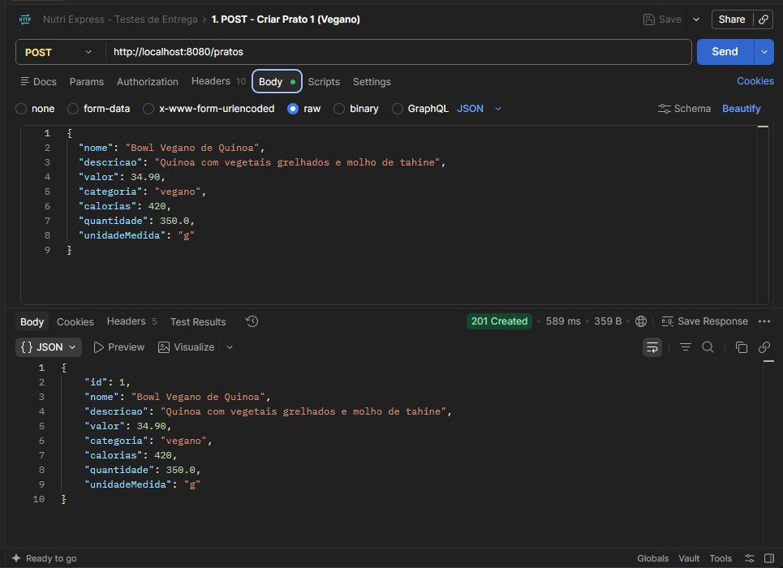

### Evidência 02 — Criar Prato 2 (Fitness) — `POST /pratos` (201 Created)
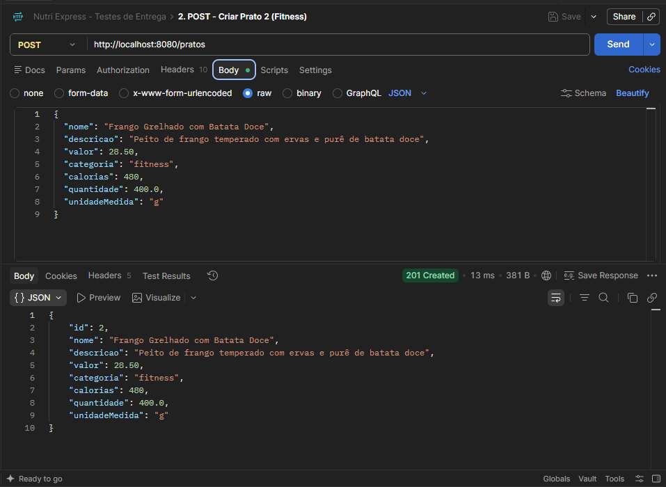

### Evidência 03 — Criar Prato 3 (Sobremesa) — `POST /pratos` (201 Created)
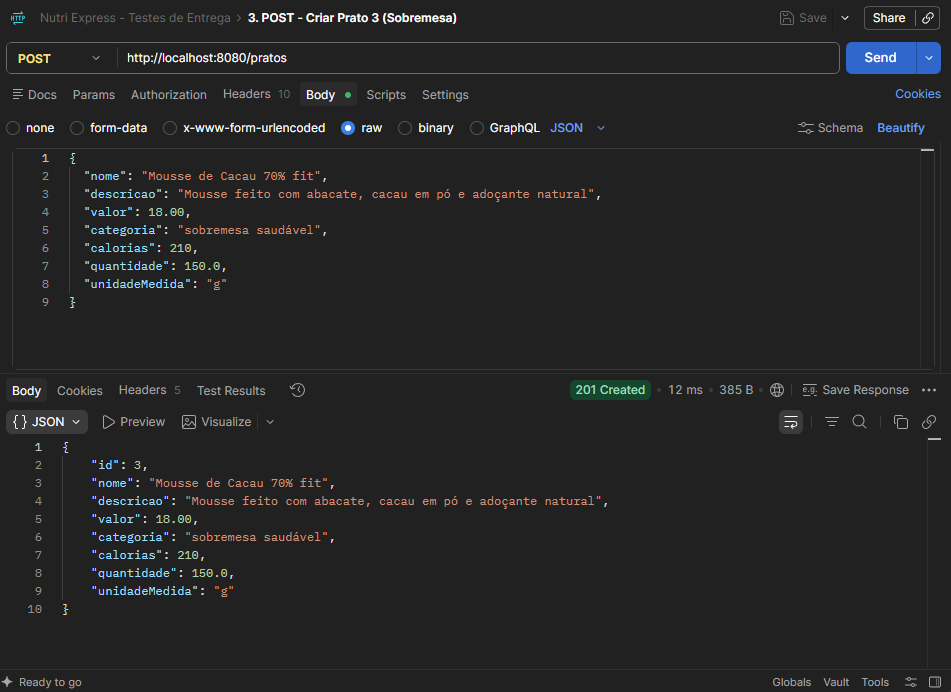

### Evidência 04 — Listar Todos os Pratos — `GET /pratos` (200 OK)
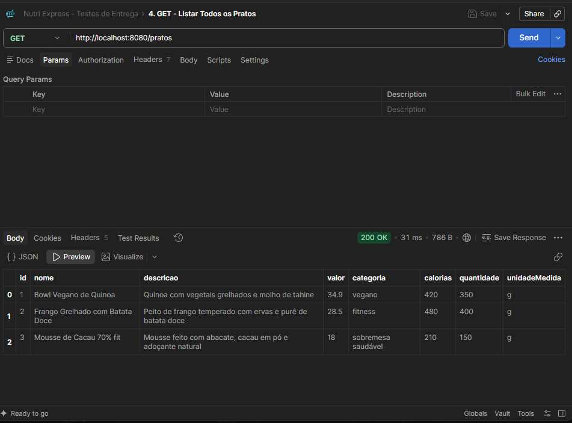

### Evidência 05 — Buscar Prato por ID — `GET /pratos/1` (200 OK)
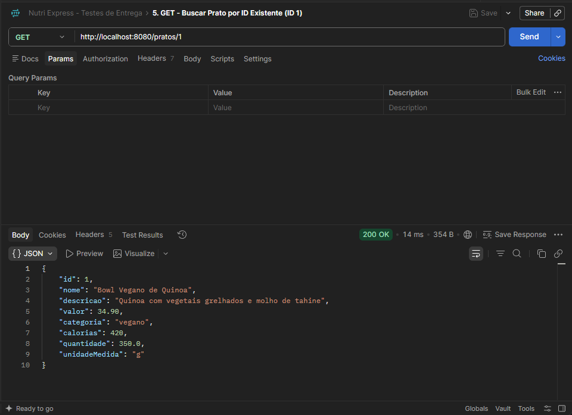

### Evidência 06 — Buscar Prato Inexistente — `GET /pratos/999` (404 Not Found)
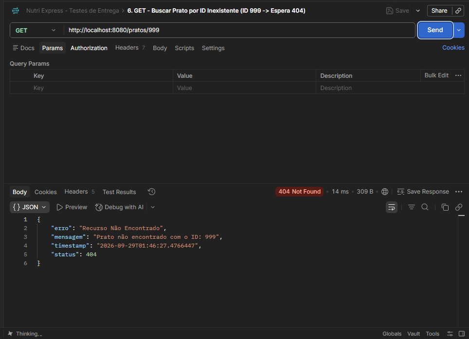

### Evidência 07 — Filtrar por Categoria — `GET /pratos?categoria=vegano` (200 OK)
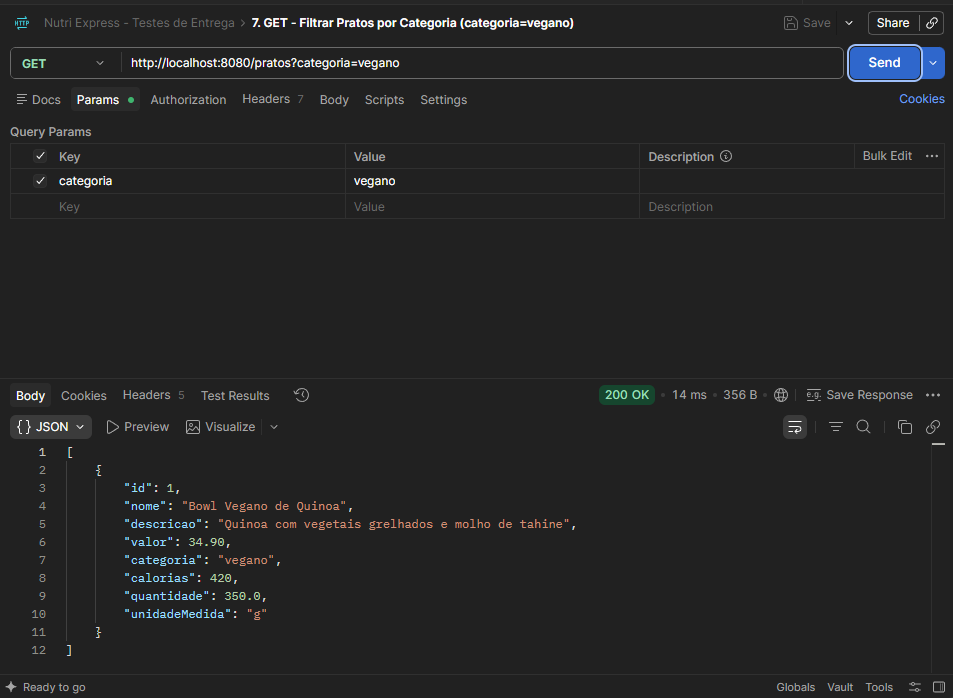

### Evidência 08 — Filtrar por Calorias — `GET /pratos/calorias?max=500` (200 OK)
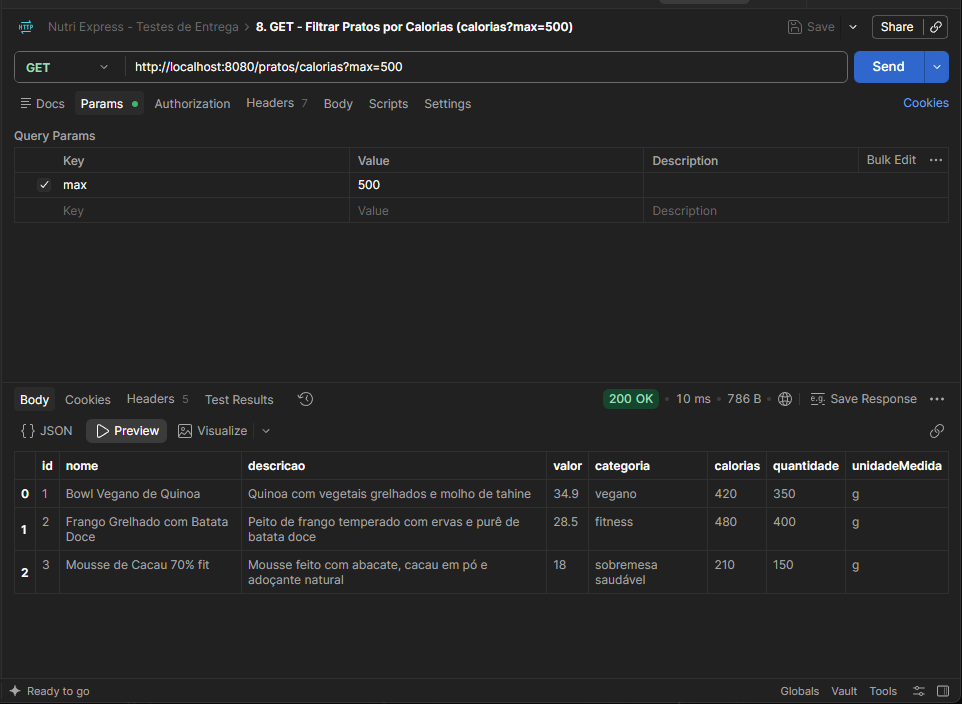

### Evidência 09 — Atualizar Prato Existente — `PUT /pratos/1` (200 OK)
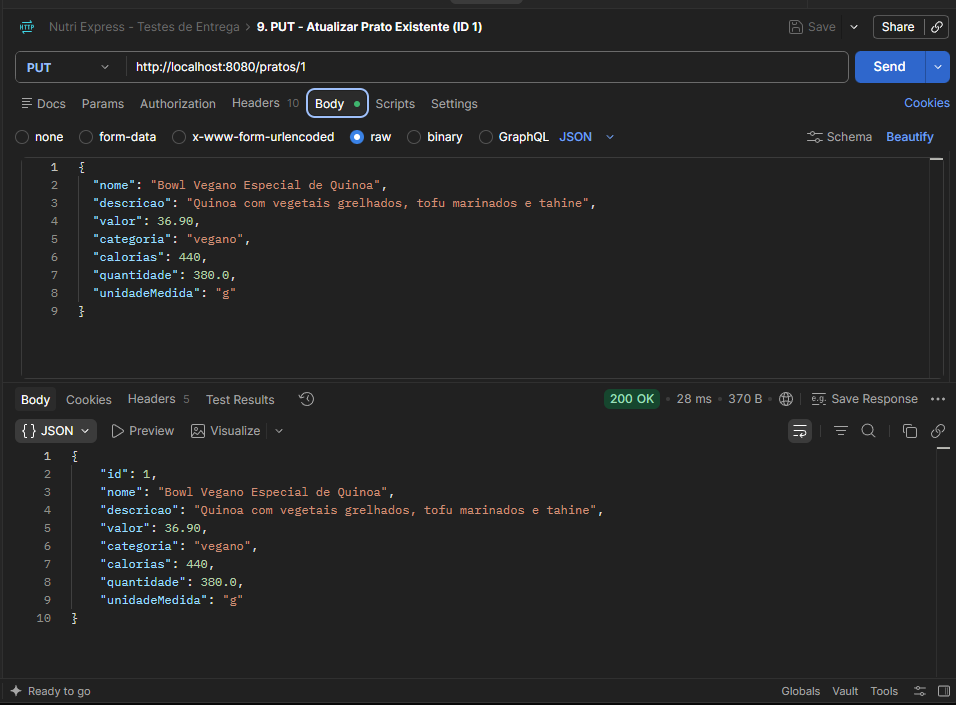

### Evidência 10 — Atualizar Somente Valor — `PATCH /pratos/1/valor` (200 OK)
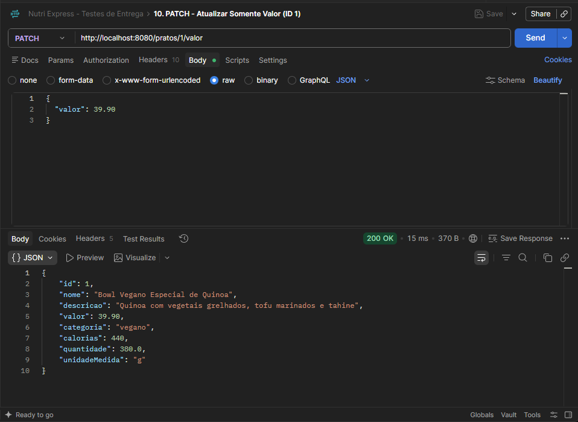

### Evidência 11 — Remover Prato — `DELETE /pratos/1` (204 No Content)
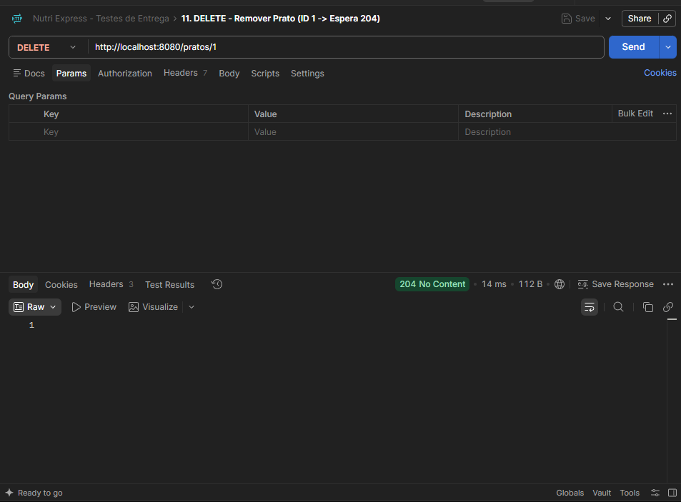

### Evidência 12 — Criar Prato Inválido — `POST /pratos` (400 Bad Request)
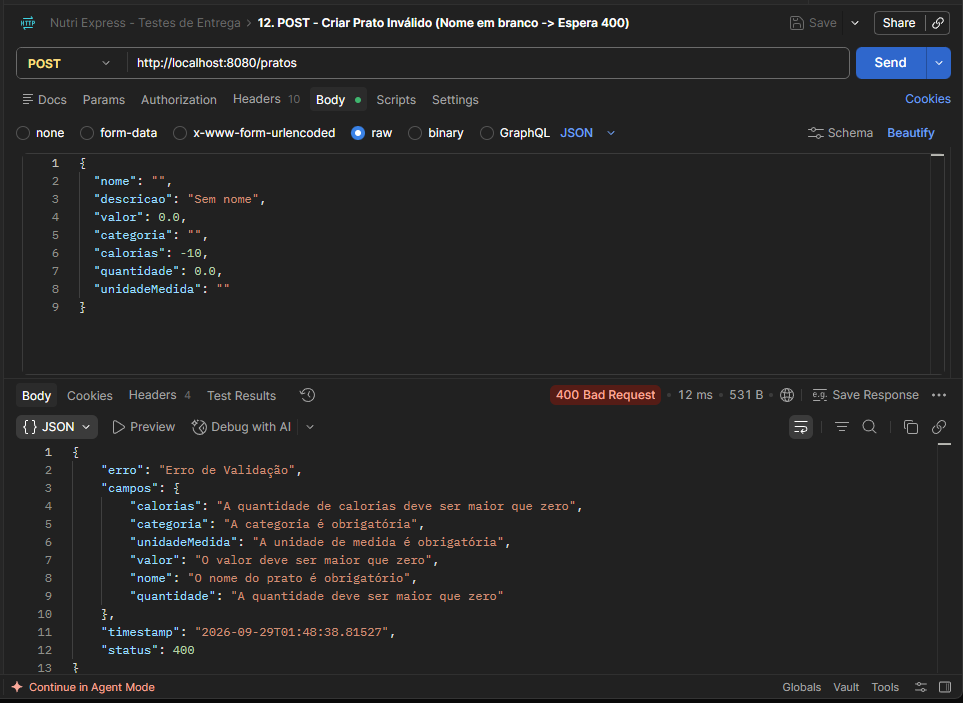